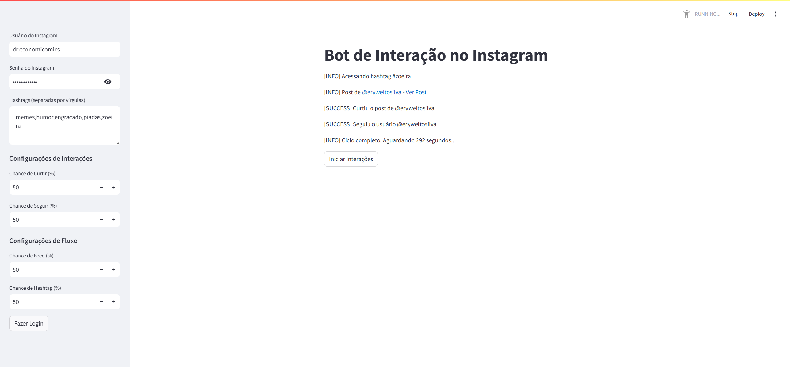

# 📷 Instagram Interaction Bot

Um bot 100% funcional para automatizar interações no Instagram!  
Ele realiza ações como curtir postagens, seguir usuários e comentar em publicações com base em hashtags ou no feed. Tudo é configurável e gerenciado através de uma interface interativa.

Abaixo está uma captura de tela da interface gráfica do bot em funcionamento:


---

## ⚠️ **Aviso Importante**

> **Este projeto é apenas para fins educacionais.**  
> Durante os meus testes, o bot foi detectado pelo Instagram diariamente, o que resultou em:
> - Necessidade de resolver desafios (*challenge required*).
> - Desconexões frequentes.  
>  
> **Se tiver ideias para melhorias, compartilhe comigo!** Criei este bot porque não tenho tempo para crescer meu Instagram gastando 2–4 horas por dia. Achei que seria mais simples.

---

## 📋 **Recursos**

### 🔄 **Interações Automatizadas**
- **Feed**: Interage com postagens no feed de quem você segue.
- **Hashtags**: Busca postagens recentes com base em hashtags configuradas.
- Configuração personalizada de:
  - Probabilidade de curtir postagens.
  - Probabilidade de seguir usuários.
- Fluxo configurável entre **feed** e **hashtags**.

### 🖥️ **Interface Gráfica**
- Interface construída com **Streamlit** para fácil configuração e monitoramento.
- Visualize logs em tempo real.

### 🔐 **Sessões Persistentes**
- Login persistente usando arquivos de sessão.
- Evita relogins frequentes e utiliza UUIDs para manter a mesma "identidade" do dispositivo.

---

## 🛠️ **Instalação**

1. **Clone o repositório**:
   ```bash
   git clone https://github.com/seu-usuario/instagram-interaction-bot.git
   cd instagram-interaction-bot
